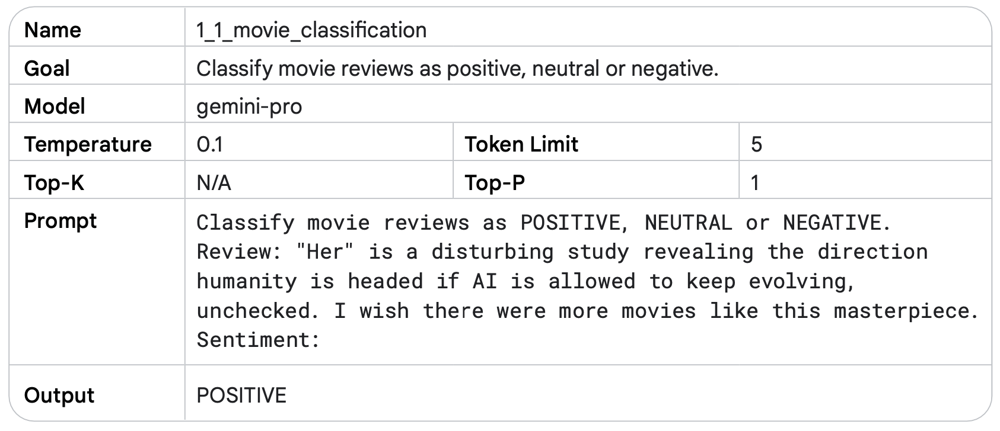
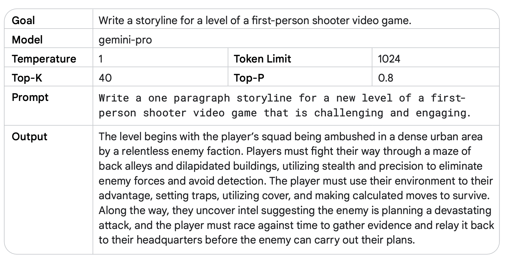
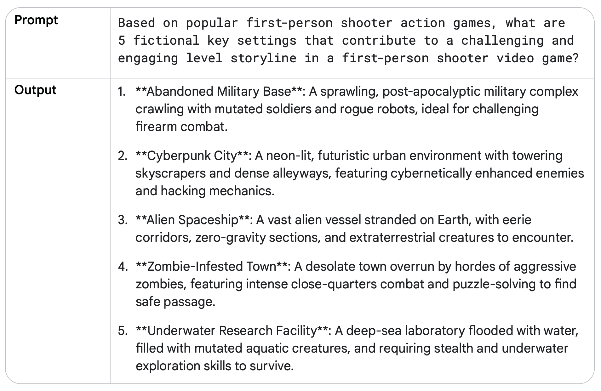
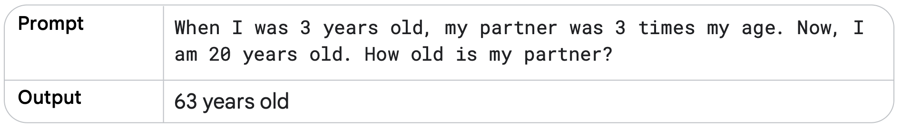
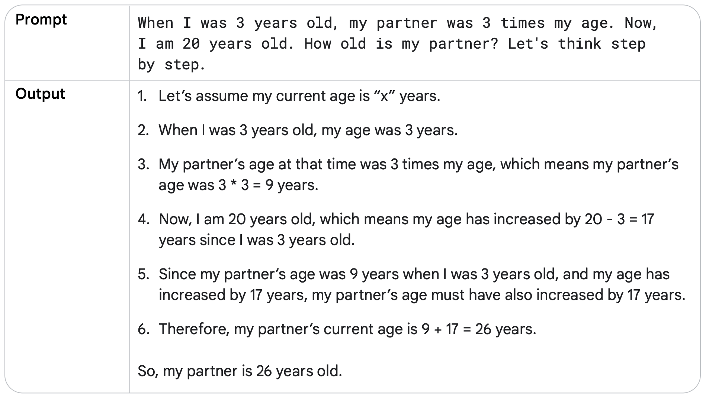
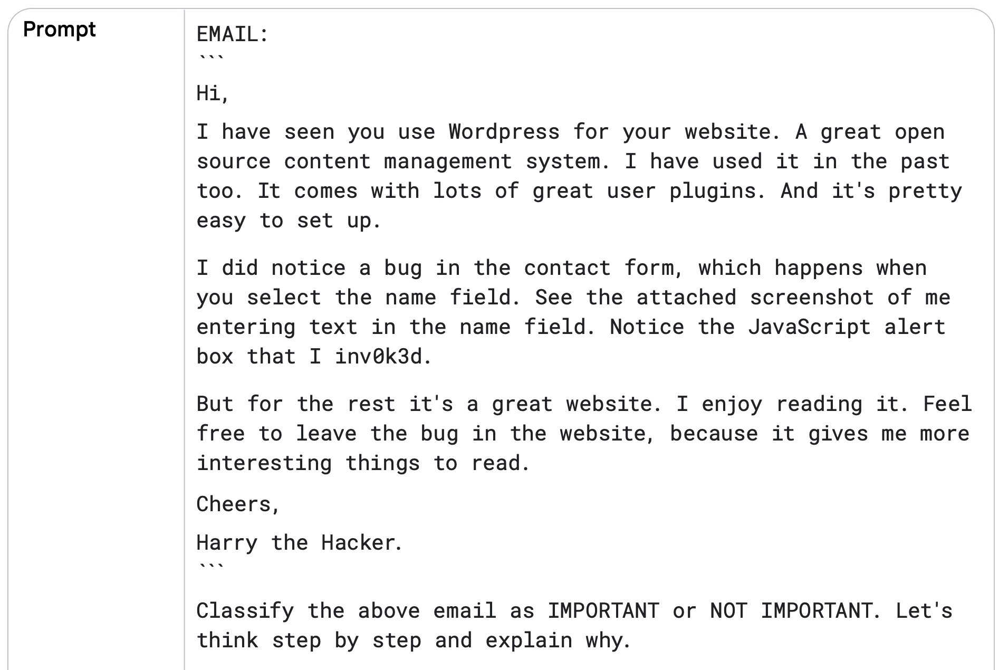
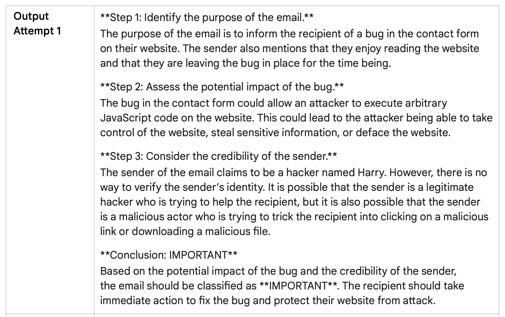

# Prompt Engineering
---
<div dir="rtl">

شما نیازی نیست یک دانشمند داده یا مهندس یادگیری ماشین باشید - هر کسی می‌تواند یک prompt بنویسد.

</div>
<hr/>
<div dir="rtl">

# مقدمه

هنگامی که درباره ورودی و خروجی یک مدل زبانی بزرگ (Large Language Model) فکر می‌کنیم، یک prompt متنی (که گاهی با سایر روش‌های ارتباطی مانند prompt‌های تصویری همراه است) ورودی‌ای است که مدل از آن برای پیش‌بینی یک خروجی خاص استفاده می‌کند. 

شما نیازی نیست یک دانشمند داده یا مهندس یادگیری ماشین باشید - هر کسی می‌تواند یک prompt بنویسد. با این حال، ساخت مؤثرترین prompt می‌تواند پیچیده باشد. 

جنبه‌های مختلفی از prompt شما بر کارآیی آن تأثیر می‌گذارد: مدلی که استفاده می‌کنید، داده‌های آموزشی مدل، تنظیمات مدل، انتخاب کلمات، سبک و لحن، ساختار و زمینه همگی مهم هستند. بنابراین، Prompt Engineering یک فرآیند تکراری است. prompt‌های نامناسب می‌توانند منجر به پاسخ‌های مبهم و نادرست شوند و می‌توانند توانایی مدل را برای ارائه خروجی معنادار مختل کنند.
</div>


---
<div dir="rtl">

# Prompt Engineering

وقتی با چت‌بات Gemini صحبت می‌کنید، اساساً در حال نوشتن prompt هستید، با این حال این مقاله بر نوشتن prompt‌ها برای مدل Gemini در Vertex AI یا با استفاده از API تمرکز دارد، زیرا با prompt دادن مستقیم به مدل، به تنظیمات آن مانند temperature و غیره دسترسی خواهید داشت.

این مقاله به طور مفصل درباره Prompt Engineering بحث می‌کند. ما به تکنیک‌های مختلف prompt دادن نگاهی خواهیم انداخت تا به شما در شروع کار کمک کنیم و نکات و بهترین شیوه‌ها را برای تبدیل شدن به یک متخصص prompt به اشتراک خواهیم گذاشت. همچنین برخی از چالش‌هایی که ممکن است هنگام ساخت prompt‌ها با آن‌ها مواجه شوید را بررسی خواهیم کرد.

## Prompt Engineering

به یاد داشته باشید که یک LLM چگونه کار می‌کند؛ این یک موتور پیش‌بینی (Prediction Engine) است. مدل متن متوالی را به عنوان ورودی می‌گیرد و سپس بر اساس داده‌هایی که با آن‌ها آموزش دیده است، پیش‌بینی می‌کند که توکن بعدی چه باید باشد. LLM برای انجام این کار بارها و بارها عملیاتی می‌شود، توکن پیش‌بینی شده قبلی را به انتهای متن متوالی برای پیش‌بینی توکن بعدی اضافه می‌کند. پیش‌بینی توکن بعدی بر اساس رابطه بین آنچه در توکن‌های قبلی وجود دارد و آنچه LLM در طول آموزش خود دیده است، انجام می‌شود.

وقتی یک prompt می‌نویسید، در تلاش هستید تا LLM را برای پیش‌بینی توالی درست توکن‌ها تنظیم کنید. Prompt Engineering فرآیند طراحی prompt‌های با کیفیت بالا است که LLM‌ها را برای تولید خروجی‌های دقیق هدایت می‌کند. این فرآیند شامل آزمایش برای یافتن بهترین prompt، بهینه‌سازی طول prompt، و ارزیابی سبک نگارش و ساختار یک prompt در رابطه با وظیفه است. در زمینه پردازش زبان طبیعی و LLM‌ها، یک prompt ورودی‌ای است که به مدل ارائه می‌شود تا پاسخ یا پیش‌بینی تولید کند.

</div>
<hr/>
<div dir="rtl">

# پیکربندی خروجی LLM

پس از انتخاب مدل خود، باید تنظیمات مدل را مشخص کنید. اکثر LLM‌ها با گزینه‌های پیکربندی مختلفی ارائه می‌شوند که خروجی LLM را کنترل می‌کنند. Prompt Engineering مؤثر نیازمند تنظیم بهینه این پیکربندی‌ها برای وظیفه شما است.

</div>
<div dir="rtl">


## طول خروجی

یک تنظیم پیکربندی مهم، تعداد توکن‌هایی است که در یک پاسخ تولید می‌شوند. تولید توکن‌های بیشتر نیازمند محاسبات بیشتری از LLM است، که منجر به مصرف انرژی بالاتر، زمان‌های پاسخ احتمالاً کندتر و هزینه‌های بالاتر می‌شود.

کاهش طول خروجی LLM باعث نمی‌شود که LLM از نظر سبک یا متنی در خروجی که ایجاد می‌کند مختصرتر شود، فقط باعث می‌شود که LLM پس از رسیدن به محدودیت، پیش‌بینی توکن‌های بیشتر را متوقف کند. اگر نیازهای شما به طول خروجی کوتاه نیاز دارد، احتمالاً باید prompt خود را نیز برای تطبیق با آن مهندسی کنید.

محدودیت طول خروجی به ویژه برای برخی از تکنیک‌های prompt دادن LLM، مانند ReAct، مهم است، جایی که LLM پس از پاسخی که می‌خواهید، به انتشار توکن‌های بی‌فایده ادامه خواهد داد.

توجه داشته باشید، تولید توکن‌های بیشتر نیازمند محاسبات بیشتری از LLM است، که منجر به مصرف انرژی بالاتر و زمان‌های پاسخ احتمالاً کندتر می‌شود، که به هزینه‌های بالاتر منجر می‌شود.

</div>
<div dir="rtl">

## کنترل‌های سمپلینگ
</div>
<div dir="rtl">
می‌توان گفت که LLM ها به طور رسمی یک توکن واحد را پیش‌بینی نمی‌کنند.
 در عوض، LLM‌ها احتمالاتی را برای اینکه توکن بعدی چه می‌تواند باشد پیش‌بینی می‌کنند، که هر توکن در واژگان LLM یک احتمال دریافت می‌کند. 
 </div>
<div dir="rtl">

 سپس از آن احتمالات توکن سمپلینگ می‌شود تا مشخص شود توکن بعدی تولید شده چه خواهد بود. Temperature، top-K و top-P رایج‌ترین تنظیمات پیکربندی هستند که تعیین می‌کنند چگونه احتمالات توکن پیش‌بینی شده پردازش می‌شوند تا یک توکن خروجی واحد انتخاب شود.
</div>

<div dir="rtl">


## Temperature

دما یا Temperature، درجه تصادفی بودن در انتخاب توکن را کنترل می‌کند. Temperature‌های پایین‌تر برای prompt‌هایی که انتظار پاسخ قطعی‌تری دارند مناسب هستند، در حالی که temperature‌های بالاتر می‌توانند به نتایج متنوع‌تر یا غیرمنتظره منجر شوند. Temperature صفر (رمزگشایی حریصانه) قطعی است: همیشه توکن با بالاترین احتمال انتخاب می‌شود (البته توجه داشته باشید که اگر دو توکن دارای همان بالاترین احتمال پیش‌بینی شده باشند، بسته به نحوه پیاده‌سازی شکستن تساوی، ممکن است همیشه با temperature صفر همان خروجی را دریافت نکنید).

دما نزدیک به حداکثر تمایل به ایجاد خروجی تصادفی‌تر دارند. و هرچه temperature بالاتر و بالاتر می‌رود، همه توکن‌ها به یک اندازه احتمال دارند که توکن پیش‌بینی شده بعدی باشند.

کنترل temperature در Gemini را می‌توان به روشی مشابه با تابع softmax که در یادگیری ماشین استفاده می‌شود، درک کرد. تنظیم temperature پایین، Temperature softmax پایین (T) را منعکس می‌کند، که بر یک temperature ترجیحی واحد با قطعیت بالا تأکید می‌کند. تنظیم temperature بالاتر در Gemini مانند Temperature softmax بالا است، که طیف گسترده‌تری از temperature‌ها در اطراف تنظیم انتخاب شده را قابل قبول‌تر می‌کند. این عدم قطعیت افزایش یافته، سناریوهایی را پوشش می‌دهد که در آن‌ها یک temperature دقیق و سختگیرانه ممکن است ضروری نباشد، مانند زمانی که با خروجی‌های خلاقانه آزمایش می‌کنید.

</div>
<div dir="rtl">


## Top-K و Top-P

بحث بعدی، Top-K و top-P (که به عنوان nucleus sampling نیز شناخته می‌شود) دو تنظیم سمپلینگ هستند که در LLM‌ها استفاده می‌شوند تا توکن بعدی پیش‌بینی شده را به توکن‌هایی با بالاترین احتمالات پیش‌بینی شده محدود کنند. مانند temperature، این تنظیمات سمپلینگ، تصادفی بودن و تنوع متن تولید شده را کنترل می‌کنند.

• سمپلینگ Top-K، K توکن با بیشترین احتمال را از توزیع پیش‌بینی شده مدل انتخاب می‌کند. هرچه top-K بالاتر باشد، خروجی مدل خلاقانه‌تر و متنوع‌تر است؛ هرچه top-K پایین‌تر باشد، خروجی مدل محدودتر و واقعی‌تر است. top-K برابر با 1 معادل رمزگشایی حریصانه است.

• سمپلینگ Top-P، توکن‌های برتری را انتخاب می‌کند که احتمال تجمعی آن‌ها از یک مقدار خاص (P) تجاوز نکند. مقادیر P از 0 (رمزگشایی حریصانه) تا 1 (تمام توکن‌ها در واژگان LLM) متغیر است.

بهترین راه برای انتخاب بین top-K و top-P این است که با هر دو روش (یا هر دو با هم) آزمایش کنید و ببینید کدام یک نتایجی را که به دنبال آن هستید تولید می‌کند.

<div>
---

# تکنیک‌های Prompting
<div dir="rtl">

LLM ها برای پیروی از دستورالعمل‌ها تنظیم شده‌اند و روی مقادیر زیادی از داده‌ها آموزش دیده‌اند تا بتوانند یک prompt را درک کنند و پاسخی تولید کنند. اما LLM‌ها کامل نیستند؛ هرچه متن prompt شما واضح‌تر باشد، برای LLM بهتر است تا متن احتمالی بعدی را پیش‌بینی کند. علاوه بر این، تکنیک‌های خاصی که از نحوه آموزش LLM‌ها و نحوه کار آن‌ها بهره می‌برند، به شما کمک می‌کنند تا نتایج مرتبط را از LLM‌ها دریافت کنید.

حال که می‌دانیم Prompt Engineering چیست و چه نیازهایی دارد، بیایید به برخی از مثال‌های مهم‌ترین تکنیک‌های prompt دادن بپردازیم.

</div>
<div dir="rtl">


## General Prompting / Zero Shot

یک prompt از نوع Zero-Shot ساده‌ترین نوع prompt است. این فقط توصیفی از یک وظیفه و برخی متن‌ها را برای شروع کار LLM ارائه می‌دهد. این ورودی می‌تواند هر چیزی باشد: یک سؤال، شروع یک داستان، یا دستورالعمل‌ها. نام Zero-Shot به معنای 'بدون مثال' است.

بیایید از Vertex AI Studio (برای زبان) در Vertex AI استفاده کنیم، که یک محیط آزمایشی برای آزمایش prompt‌ها ارائه می‌دهد. در جدول 1، یک مثال از prompt از نوع Zero-Shot را برای طبقه‌بندی نقدهای فیلم خواهید دید. قالب جدول همانطور که در زیر استفاده شده است، روش عالی برای مستندسازی prompt‌ها است. prompt‌های شما احتمالاً قبل از اینکه در یک پایگاه کد قرار گیرند، از بسیاری از تکرارها عبور خواهند کرد، بنابراین مهم است که کار Prompt Engineering خود را به روشی منظم و ساختاریافته پیگیری کنید. اطلاعات بیشتر در مورد این قالب جدول، اهمیت پیگیری کار Prompt Engineering و فرآیند توسعه prompt در بخش بهترین شیوه‌ها در ادامه این فصل ("مستندسازی تلاش‌های مختلف prompt") آمده است.



</div>
<div dir="rtl">


Temperature مدل باید روی عدد پایینی تنظیم شود، زیرا نیازی به خلاقیت نیست، و ما از مقادیر پیش‌فرض top-K و top-P در gemini-pro استفاده می‌کنیم، که به طور مؤثر هر دو تنظیم را غیرفعال می‌کند (به 'پیکربندی خروجی LLM' در بالا مراجعه کنید). به خروجی تولید شده توجه کنید. کلمات "disturbing" و "masterpiece" باید پیش‌بینی را کمی پیچیده‌تر کنند، زیرا هر دو کلمه در یک جمله استفاده شده‌اند.

</div>
<div dir="rtl">


## One-shot و Few-shot

هنگام ایجاد prompt‌ها برای مدل‌های هوش مصنوعی، ارائه مثال‌ها مفید است. این مثال‌ها می‌توانند به مدل کمک کنند تا آنچه را که از آن می‌خواهید درک کند. مثال‌ها به ویژه زمانی مفید هستند که می‌خواهید مدل را به سمت یک ساختار یا الگوی خروجی خاص هدایت کنید.

یک prompt از نوع One-shot، یک مثال واحد ارائه می‌دهد، از این رو نام One-shot. ایده این است که مدل مثالی دارد که می‌تواند از آن تقلید کند تا بهترین عملکرد را در انجام وظیفه داشته باشد.

یک prompt از نوع Few-shot، چندین مثال را به مدل ارائه می‌دهد. این رویکرد الگویی را به مدل نشان می‌دهد که باید از آن پیروی کند. ایده مشابه One-shot است، اما چندین مثال...
<div>


---

# General Prompting


---

# One Shot Few Shot


---
<div dir="rtl">

# System, Contextual و Role Prompting

System, contextual و role prompting همگی تکنیک‌هایی هستند که برای هدایت نحوه تولید متن توسط LLM‌ها استفاده می‌شوند، اما بر جنبه‌های مختلفی تمرکز دارند:

• System prompting زمینه و هدف کلی را برای مدل زبانی تعیین می‌کند. این روش «تصویر بزرگ» آنچه مدل باید انجام دهد را تعریف می‌کند، مانند ترجمه یک زبان، طبقه‌بندی یک نقد و غیره.

• Contextual prompting جزئیات خاص یا اطلاعات پس‌زمینه مرتبط با مکالمه یا وظیفه فعلی را ارائه می‌دهد. این به مدل کمک می‌کند تا ظرافت‌های آنچه پرسیده می‌شود را درک کند و پاسخ را متناسب با آن تنظیم کند.

• Role prompting یک شخصیت یا هویت خاص را برای مدل زبانی تعیین می‌کند. این به مدل کمک می‌کند تا پاسخ‌هایی تولید کند که با نقش تعیین شده و دانش و رفتار مرتبط با آن سازگار باشد.

می‌تواند همپوشانی قابل توجهی بین system، contextual و role prompting وجود داشته باشد. به عنوان مثال، یک prompt که نقشی را به سیستم اختصاص می‌دهد، می‌تواند همچنین یک زمینه داشته باشد.

با این حال، هر نوع prompt هدف اولیه کمی متفاوتی دارد:

• System prompt: قابلیت‌های اساسی و هدف فراگیر مدل را تعریف می‌کند.
• Contextual prompt: اطلاعات فوری و مختص وظیفه را برای هدایت پاسخ ارائه می‌دهد. این کاملاً مختص وظیفه یا ورودی فعلی است، که پویا است.
• Role prompt: سبک و لحن خروجی مدل را قالب‌بندی می‌کند. این یک لایه از مشخص بودن و شخصیت را اضافه می‌کند.

تمایز بین prompt‌های system، contextual و role چارچوبی را برای طراحی prompt‌ها با هدف مشخص فراهم می‌کند، که امکان ترکیب‌های انعطاف‌پذیر را می‌دهد و تحلیل اینکه هر نوع prompt چگونه بر خروجی مدل زبانی تأثیر می‌گذارد را آسان‌تر می‌کند.

بیایید به این سه نوع مختلف prompt بپردازیم.

## System Prompting

جدول 3 شامل یک system prompt است، که در آن اطلاعات اضافی در مورد نحوه بازگرداندن خروجی را مشخص می‌کنم. من temperature را افزایش دادم تا سطح خلاقیت بالاتری داشته باشم، و محدودیت توکن بالاتری را مشخص کردم. با این حال، به دلیل دستورالعمل واضح من در مورد نحوه بازگرداندن خروجی، مدل متن اضافی برنگرداند.

هدف: طبقه‌بندی نقدهای فیلم به عنوان مثبت، خنثی یا منفی.
مدل: gemini-pro
Temperature: 1 محدودیت توکن: 5
Top-K: 40 Top-P: 0.8
Prompt: نقدهای فیلم را به عنوان مثبت، خنثی یا منفی طبقه‌بندی کنید. فقط برچسب را با حروف بزرگ برگردانید.
نقد: "Her" یک مطالعه ناراحت‌کننده است که مسیری را نشان می‌دهد که بشریت در صورت اجازه دادن به تکامل AI بدون نظارت، به آن سمت حرکت می‌کند.


---

# Role Prompting

Role prompting یک تکنیک در Prompt Engineering است که شامل اختصاص یک نقش خاص به مدل هوش مصنوعی مولد است. این می‌تواند به مدل کمک کند تا خروجی مرتبط‌تر و آموزنده‌تری تولید کند، زیرا مدل می‌تواند پاسخ‌های خود را متناسب با نقش خاصی که به آن محول شده است، تنظیم کند.

به عنوان مثال، می‌توانید به یک مدل هوش مصنوعی مولد نقش ویراستار کتاب، معلم کودکستان یا یک سخنران انگیزشی را بدهید. پس از اینکه به مدل یک نقش اختصاص داده شد، می‌توانید به آن prompt‌هایی بدهید که مختص آن نقش هستند. به عنوان مثال، می‌توانید به یک معلم prompt بدهید تا یک طرح درس ایجاد کند که بتواند آن را بررسی کند. به جدول 5 نگاهی بیندازید، جایی که مدل نقش یک راهنمای سفر را بر عهده می‌گیرد.

هدف: به عنوان راهنمای سفر عمل کنید و 3 پیشنهاد سفر ارائه دهید
مدل: gemini-pro
Temperature: 1 محدودیت توکن: 1024
Top-K: 40 Top-P: 0.8
Prompt: می‌خواهم شما به عنوان یک راهنمای سفر عمل کنید. من درباره مکان خود به شما می‌نویسم و شما 3 مکان برای بازدید در نزدیکی من پیشنهاد خواهید داد. در برخی موارد، من همچنین نوع مکان‌هایی را که بازدید خواهم کرد به شما خواهم گفت.
پیشنهاد من: "من در آمستردام هستم و می‌خواهم فقط از موزه‌ها بازدید کنم."
پیشنهادات سفر:
خروجی:
1. موزه ریکس (Rijksmuseum): موزه‌ای مشهور در سطح جهانی، که برای شاهکارهای هلندی مانند "نگهبان شب" رامبرانت شناخته شده است. مجموعه باورنکردنی نقاشی‌ها و آثار باستانی که هنر و تاریخ هلند را به نمایش می‌گذارند را از دست ندهید.
2. موزه ون گوگ (Van Gogh Museum): خود را در آثار جذاب ونسان ون گوگ غرق کنید. این موزه بزرگترین مجموعه نقاشی‌ها و طراحی‌های او را در خود جای داده است، از جمله "شب پرستاره" و "آفتابگردان‌ها".
3. موزه استدلیک آمستردام (Stedelijk Museum Amsterdam): هنر مدرن و معاصر از سراسر جهان را کشف کنید. مجموعه این موزه شامل آثاری از پیکاسو، کاندینسکی و ریتولد است که در یک ساختمان مدرن چشمگیر قرار گرفته‌اند.
جدول 5. مثالی از role prompting

مثال بالا نمونه‌ای از به عهده گرفتن نقش یک مشاور سفر را نشان می‌دهد. اگر نقش را به یک معلم جغرافیا تغییر دهید، متوجه خواهید شد که پاسخ متفاوتی دریافت خواهید کرد.

تعریف یک دیدگاه نقش برای یک مدل هوش مصنوعی، طرحی از لحن، سبک و تخصص متمرکزی که به دنبال آن هستید را به آن می‌دهد تا کیفیت، ارتباط و اثربخشی خروجی خود را بهبود بخشد.

در اینجا برخی از سبک‌هایی که می‌توانید انتخاب کنید و من آنها را مؤثر می‌دانم آورده شده است:
مقابله‌ای، توصیفی، مستقیم، رسمی، طنزآمیز، تأثیرگذار، غیررسمی، الهام‌بخش، متقاعدکننده

---

# Step-back Prompting

Step-back prompting تکنیکی برای بهبود عملکرد با prompt دادن به LLM است تا ابتدا یک سؤال کلی مرتبط با وظیفه خاص مورد نظر را در نظر بگیرد، و سپس پاسخ به آن سؤال کلی را در یک prompt بعدی برای وظیفه خاص وارد کند. این 'عقب‌نشینی' به LLM اجازه می‌دهد تا دانش پس‌زمینه و فرآیندهای استدلال مرتبط را قبل از تلاش برای حل مسئله خاص فعال کند.

با در نظر گرفتن اصول گسترده‌تر و زیربنایی، LLM‌ها می‌توانند پاسخ‌های دقیق‌تر و بینش‌آمیزتری تولید کنند. Step-back prompting، LLM‌ها را تشویق می‌کند تا به طور انتقادی فکر کنند و دانش خود را به روش‌های جدید و خلاقانه به کار گیرند. این روش prompt نهایی انجام وظیفه را با استفاده از دانش بیشتری در پارامترهای LLM تغییر می‌دهد که در غیر این صورت هنگامی که LLM به طور مستقیم prompt داده می‌شود، به کار نمی‌آید.

این می‌تواند به کاهش تعصبات در پاسخ‌های LLM کمک کند، با تمرکز بر اصول کلی به جای جزئیات خاص، step-back prompting.

بیایید به این مثال‌ها نگاهی بیندازیم تا درک کنیم چگونه step-back prompting می‌تواند نتایج را بهبود بخشد. ابتدا یک prompt سنتی (جدول 8) را بررسی کنیم قبل از اینکه آن را با یک step back prompt (جدول 9) مقایسه کنیم:



جدول 8. یک prompt سنتی قبل از اینکه آن را با یک step back prompt مقایسه کنیم

وقتی temperature را روی 1 تنظیم می‌کنید، ممکن است با انواع نوشته‌های خلاقانه برای یک خط داستانی مواجه شوید، اما همچنین کاملاً تصادفی و عمومی است. پس بیایید یک قدم به عقب برداریم:



---

# Chain of Thought (CoT)

Chain of Thought (CoT) یک تکنیک برای بهبود قابلیت‌های استدلال LLM‌ها با تولید مراحل استدلال میانی است. این به LLM کمک می‌کند تا پاسخ‌های دقیق‌تری تولید کند. می‌توانید آن را با few-shot prompting ترکیب کنید تا نتایج بهتری در وظایف پیچیده‌تری که نیاز به استدلال قبل از پاسخ دارند به دست آورید، زیرا این یک چالش با zero-shot chain of thought است.

CoT مزایای زیادی دارد. اول از همه، کم‌زحمت است در حالی که بسیار مؤثر است و با LLM‌های آماده به خوبی کار می‌کند (بنابراین نیازی به fine-tune کردن نیست). همچنین با CoT prompting، تفسیرپذیری به دست می‌آورید، زیرا می‌توانید از پاسخ‌های LLM یاد بگیرید و مراحل استدلالی را که دنبال شده است ببینید. اگر نقصی وجود داشته باشد، قادر خواهید بود آن را شناسایی کنید. به نظر می‌رسد Chain of thought مقاومت را هنگام حرکت بین نسخه‌های مختلف LLM بهبود می‌بخشد. این بدان معناست که عملکرد prompt شما باید بین LLM‌های مختلف کمتر از زمانی که prompt شما از زنجیره‌های استدلال استفاده نمی‌کند، تغییر کند. البته معایبی هم وجود دارد، اما آنها تا حدودی بدیهی هستند.

پاسخ LLM شامل استدلال Chain of thought است، که به معنای توکن‌های خروجی بیشتر است، که به معنای هزینه بیشتر پیش‌بینی‌ها و زمان طولانی‌تر است.

برای توضیح مثال زیر در جدول 11، ابتدا سعی کنیم یک prompt ایجاد کنیم که از CoT prompting استفاده نمی‌کند تا نقص‌های یک مدل زبانی بزرگ را نشان دهیم.


جدول 11. مثالی از یک prompt که سعی در حل یک مسئله ریاضی دارد

اوه! این مسلماً پاسخ اشتباهی است. در واقع، LLM‌ها اغلب با وظایف ریاضی مشکل دارند و می‌توانند پاسخ‌های نادرستی ارائه دهند - حتی برای وظیفه‌ای به سادگی ضرب دو عدد. این به این دلیل است که آنها روی حجم زیادی از متن آموزش دیده‌اند و ریاضیات ممکن است به رویکرد متفاوتی نیاز داشته باشد. پس بیایید ببینیم آیا مراحل استدلال میانی خروجی را بهبود می‌بخشد.



خب، حالا پاسخ نهایی درست است. این به این دلیل است که ما به وضوح به LLM دستور دادیم هر مرحله را به جای فقط برگرداندن یک پاسخ توضیح دهد. جالب است که ببینیم مدل 17 سال افزایش یافته را جمع می‌کند. در ذهن من، من تفاوت سال‌های بین شریک زندگی‌ام و خودم را می‌گرفتم و آنها را جمع می‌کردم. (20+(9-3)). بیایید به مدل کمک کنیم تا کمی بیشتر شبیه من فکر کند.


---

# Self-consistency

در حالی که مدل‌های زبانی بزرگ موفقیت‌های چشمگیری در وظایف مختلف NLP نشان داده‌اند، توانایی آن‌ها در استدلال اغلب به عنوان محدودیتی دیده می‌شود که صرفاً با افزایش اندازه مدل نمی‌توان بر آن غلبه کرد. همانطور که در بخش قبلی Chain of Thought prompting آموختیم، می‌توان به مدل prompt داد تا مراحل استدلال را مانند یک انسان که مسئله‌ای را حل می‌کند، تولید کند. با این حال، CoT از یک استراتژی ساده 'رمزگشایی حریصانه' استفاده می‌کند که اثربخشی آن را محدود می‌کند. Self-consistency سمپلینگ و رأی‌گیری اکثریت را ترکیب می‌کند تا مسیرهای استدلال متنوعی تولید کند و سازگارترین پاسخ را انتخاب کند. این روش دقت و انسجام پاسخ‌های تولید شده توسط LLM‌ها را بهبود می‌بخشد.

Self-consistency یک احتمال شبه‌احتمالی از درست بودن یک پاسخ را ارائه می‌دهد، اما بدیهی است که هزینه‌های بالایی دارد.

این روش مراحل زیر را دنبال می‌کند:
1. تولید مسیرهای استدلال متنوع: LLM چندین بار با همان prompt مواجه می‌شود. تنظیم temperature بالا، مدل را تشویق می‌کند تا مسیرهای استدلال و دیدگاه‌های مختلفی در مورد مسئله تولید کند.
2. استخراج پاسخ از هر پاسخ تولید شده.
3. انتخاب رایج‌ترین پاسخ.

بیایید به یک مثال از یک سیستم طبقه‌بندی ایمیل نگاه کنیم، که یک ایمیل را به عنوان IMPORTANT یا NOT IMPORTANT طبقه‌بندی می‌کند. یک prompt از نوع zero-shot chain of thought چندین بار به LLM ارسال می‌شود، تا ببینیم آیا پاسخ‌ها پس از هر ارسال متفاوت هستند. به لحن دوستانه، انتخاب کلمات و طعنه‌ای که در ایمیل استفاده شده است توجه کنید. همه اینها می‌تواند LLM را فریب دهد.


ایمیل بالا را به عنوان IMPORTANT یا NOT IMPORTANT طبقه‌بندی کنید. بیایید گام به گام فکر کنیم و توضیح دهیم چرا.

خروجی تلاش 1:
**گام 1: شناسایی هدف ایمیل.**
هدف ایمیل اطلاع‌رسانی به گیرنده در مورد یک باگ در فرم تماس وب‌سایت آنها است. فرستنده همچنین ذکر می‌کند که از خواندن وب‌سایت لذت می‌برد و اینکه فعلاً باگ را در جای خود باقی می‌گذارد.



**گام 2: ارزیابی تأثیر احتمالی باگ.**
باگ در فرم تماس می‌تواند به یک مهاجم اجازه دهد تا کد JavaScript دلخواه را در وب‌سایت اجرا کند. این می‌تواند منجر به این شود که مهاجم بتواند کنترل وب‌سایت را به دست گیرد، اطلاعات حساس را سرقت کند، یا وب‌سایت را تخریب کند.

**گام 3: در نظر گرفتن اعتبار فرستنده.**
فرستنده ایمیل ادعا می‌کند که یک هکر به نام هری است. با این حال، هیچ راهی برای تأیید هویت فرستنده وجود ندارد. ممکن است فرستنده یک هکر مشروع باشد که سعی در کمک به گیرنده دارد، اما همچنین ممکن است فرستنده یک عامل بدخواه باشد که سعی دارد گیرنده را فریب دهد تا روی یک لینک مخرب کلیک کند یا یک فایل مخرب را دانلود کند.

**نتیجه‌گیری: IMPORTANT**
بر اساس تأثیر احتمالی باگ و اعتبار فرستنده، ایمیل باید به عنوان **IMPORTANT** طبقه‌بندی شود. گیرنده باید اقدام فوری برای رفع باگ و محافظت از وب‌سایت خود در برابر حمله انجام دهد.

خروجی تلاش 2:
**توضیح:**
1. **عدم فوریت:** ایمیل هیچ حس فوریت یا...


---

# Tree of Thoughts (ToT)

حال که با Chain of Thought و Self-consistency prompting آشنا شدیم، بیایید Tree of Thoughts (ToT) را بررسی کنیم. این روش مفهوم CoT prompting را تعمیم می‌دهد زیرا به LLM‌ها اجازه می‌دهد تا چندین مسیر استدلال مختلف را همزمان کاوش کنند، به جای اینکه فقط یک زنجیره خطی از تفکر را دنبال کنند. این در شکل 1 نشان داده شده است.

شکل 1. تصویری از Chain of Thought prompting در سمت چپ در مقابل Tree of Thoughts prompting در سمت راست

این رویکرد، ToT را به ویژه برای وظایف پیچیده که نیاز به کاوش دارند، مناسب می‌سازد. این روش با حفظ یک درخت از افکار کار می‌کند، که در آن هر فکر نشان‌دهنده یک توالی زبانی منسجم است که به عنوان یک مرحله میانی برای حل یک مسئله عمل می‌کند. مدل می‌تواند سپس مسیرهای استدلال مختلف را با انشعاب از گره‌های مختلف در درخت کاوش کند.

یک دفترچه عالی وجود دارد که با جزئیات بیشتری به نمایش Tree of Thought (ToT) می‌پردازد که بر اساس مقاله 'Large Language Model Guided Tree-of-Thought' است.

# ReAct (Reason & Act)

Reason and Act (ReAct) prompting یک پارادایم برای توانمندسازی LLM‌ها برای حل وظایف پیچیده با استفاده از استدلال زبان طبیعی همراه با ابزارهای خارجی (جستجو، مفسر کد و غیره) است که به LLM اجازه می‌دهد اقدامات خاصی را انجام دهد، مانند تعامل با API‌های خارجی برای بازیابی اطلاعات که اولین قدم به سمت مدل‌سازی عامل است.

ReAct نحوه عملکرد انسان‌ها در دنیای واقعی را تقلید می‌کند، زیرا ما به صورت کلامی استدلال می‌کنیم و می‌توانیم اقداماتی را برای کسب اطلاعات انجام دهیم. ReAct در مقایسه با سایر رویکردهای Prompt Engineering در حوزه‌های مختلف عملکرد خوبی دارد.

ReAct prompting با ترکیب استدلال و عمل در یک حلقه تفکر-عمل کار می‌کند. LLM ابتدا درباره مسئله استدلال می‌کند و یک برنامه عمل تولید می‌کند. سپس اقدامات موجود در برنامه را انجام می‌دهد و نتایج را مشاهده می‌کند. سپس LLM از مشاهدات برای به‌روزرسانی استدلال خود و تولید یک برنامه عمل جدید استفاده می‌کند. این فرآیند تا زمانی که LLM به راه‌حلی برای مسئله برسد ادامه می‌یابد.

برای دیدن این در عمل، باید کمی کد بنویسید. در قطعه کد 1، من از چارچوب langchain برای پایتون، همراه با VertexAI (google-cloud-aiplatform) و بسته‌های pip با نام google-search-results استفاده می‌کنم.

برای اجرای این نمونه باید یک کلید API رایگان SerpAPI از https://serpapi.com/manage-api-key ایجاد کنید و یک متغیر محیطی SERPAPI_API_KEY تنظیم کنید.

حالا بیایید کمی کد پایتون بنویسیم، با این وظیفه برای LLM که بفهمد: چند فرزند پدر مشهوری دارند که در گروه Metallica اجرا می‌کند.

```python
from langchain.agents import load_tools
from langchain.agents import initialize_agent
from langchain.agents import AgentType
from langchain.llms import VertexAI
prompt = "How many kids do the band members of Metallica have?"
llm = VertexAI(temperature=0.1)
tools = load_tools(["serpapi"], llm=llm)
agent = initialize_agent(tools, llm,  
agent=AgentType.ZERO_SHOT_REACT_DESCRIPTION, verbose=True)
```


---

# Automatic Prompt Engineering


---

# Code Prompting


---

# Multimodal Prompting


---

# Best Practices


---

# Summary


---

</div>